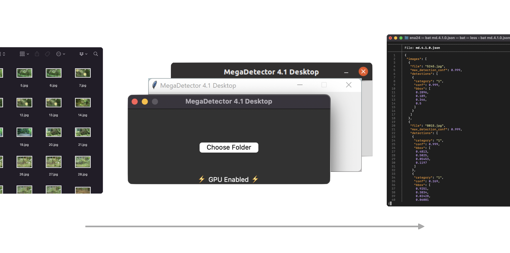

<p align="center">:warning: The MegaDetector Desktop Project has been superseded by the <a href="https://github.com/bencevans/camtrap-detector#readme">CamTrap Detector</a> project. :warning:</p>


# MegaDetector Desktop

> Warning: MegaDetector Desktop is currently considered alpha software. Expect bugs and crashes, and please report them on the [GitHub repository](https://github.com/bencevans/megadetector-desktop). For a more stable CLI utility, see the [Microsoft/CameraTraps MegaDetector Scripts](https://github.com/microsoft/CameraTraps/blob/main/megadetector.md#using-the-model).




## Install

MegaDetector Desktop is currently available for Windows (x64) and MacOS (Intel). Latest versions can be found on the [releases](https://github.com/bencevans/megadetector-desktop/releases) page.

## Citation

If you use MegaDetector Desktop in your research, please cite the original MegaDetector work:

> ```
> @article{beery2019efficient,
>  title={Efficient Pipeline for Camera Trap Image Review},
>  author={Beery, Sara and Morris, Dan and Yang, Siyu},
>  journal={arXiv preprint arXiv:1907.06772},
>  year={2019}
>}
>```
>
> > https://github.com/microsoft/CameraTraps/blob/main/megadetector.md#citing-megadetector

Furthermore, if you use MegaDetector Desktop in your research, please cite the MegaDetector Desktop project:

```
TODO
```


## Development

Details on development and building can be found in [CONTRIBUTING.md](./CONTRIBUTING.md).


## License

MIT
